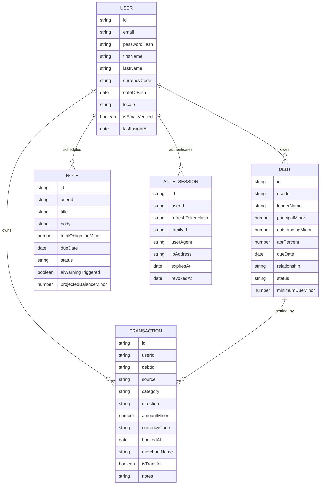

# AI Finance Coach

Production-grade fintech monorepo for Armenia-first personal finance coaching with a NestJS backend, Expo mobile client, and shared TypeScript contracts.

## System Architecture

```text
[Expo Mobile App]
  - Expo Router navigation
  - Zustand auth/session state
  - TanStack Query offline cache + replay
  - SecureStore token storage
  - Reanimated dashboard interactions
          |
          | HTTPS / JWT access token
          | Refresh token rotation
          v
[NestJS API Gateway]
  - Auth module
  - Dashboard aggregates
  - Transactions, Debts, Notes
  - AI insights + transcription adapters
  - Global validation + exception filter
          |
          | Mongoose repositories + Mongo sessions
          v
[MongoDB Replica Set]
  - Users
  - Transactions
  - Debts
  - Notes
  - AuthSessions
```

## Clean Architecture Boundaries

- `interface adapters`: controllers, DTO validation, mobile screens, query hooks.
- `application`: auth orchestration, dashboard aggregation, AI insight scheduling.
- `domain`: entities and shared contracts for transactions, debts, notes, warnings.
- `infrastructure`: Mongo schemas, JWT strategies, storage adapters, HTTP clients.

## Database ERD



## Repository Structure

```text
.
├── backend
│   ├── src
│   │   ├── common
│   │   ├── modules
│   │   │   ├── ai
│   │   │   ├── auth
│   │   │   ├── dashboard
│   │   │   ├── debts
│   │   │   ├── notes
│   │   │   ├── transactions
│   │   │   └── users
│   │   └── main.ts
│   ├── .env.example
│   └── package.json
├── mobile
│   ├── app
│   │   ├── (app)
│   │   └── (auth)
│   ├── src
│   │   ├── components
│   │   ├── features
│   │   ├── lib
│   │   ├── providers
│   │   └── theme
│   ├── .env.example
│   └── package.json
└── shared-types
    ├── src
    └── package.json
```

## Production Principles

- Strict TypeScript across all packages, with shared contracts published from `shared-types`.
- MongoDB transactions enabled through a replica set, so transaction writes and debt settlement updates are atomic.
- Refresh token rotation uses hashed server-side session storage with reuse detection.
- Mobile data access is offline-first via persisted TanStack Query caches and replay-friendly mutations.
- Default money formatting is Armenian AMD via the `hy-AM` locale.
